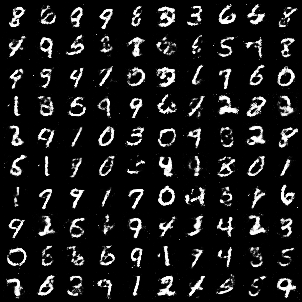

# GAN实现

为了提高速度，我这里使用的batch size都是2560。

## Vanilla GAN

使用FC layers实现的GAN model，超参数的选择参考了DCGAN：

* 激活函数: LeakyReLU(slope=0.2)
* 生成器使用了BN(momentum=0.8)
* 判别器使用了Dropout(0.5)
* 优化器使用的是Adam(beta1=0.5)
* 学习率为0.0002

经验：

* 判别器不要用BN，不然会使得判别器训练的特别快。
* 以上使用的这组DCGAN的参数效果确实不错，可以作为所有GAN训练的基准。

> 训练GAN最重要的就是要保持判别器和生成器的“共同成长”。一般来说，判别器更容易训练一些，所以其容易马上训练的非常好，任何生成器生成的样本都会被它识别为fake。这样，生成器并不能从判别器中得到有用的信息，从而使训练失败。

## DCGAN

使用全卷积结构实现的GAN model，总体效果优于Vanilla GAN。

相比于论文：

* 没有在判别器中加入BN，加入BN后会导致非常差的效果。
* 在判别器中加入了dropout(0.25)。
* 原文中的生成器结构共4层，用于生成64x64x3的图像，我这里将其减为3层，并降低了卷积核的数量，来生成28x28x1的MNIST图像。
* 为了提高速度，使用了比原文大得多的batch size(2560)。

对比了判别器的3种实现方式：

* convs + reshape + linear
* convs + global pooling + linear
* convs + global pooling (原文中介绍的方式，预先使用conv将通道数降为1，然后直接pooling后作为预测结果)

以上3种方式生成的图像质量基本没有差别，我主观来看，第一种相对更好一些。

对比了两种上采样策略：

* Upsample(x2/->size) + conv(SAME) + BN + LeakyReLU
* convTranspose + BN +LeakyReLU

以上2种方式生成的图像质量也基本没有差别，从我主观来看，第一种相对更好一些。

> 第二种速度会稍微快一些，但因为转置卷积的计算方式，其容易产生栅格状的细微噪声(当然，这种噪声在MNIST数据集上是看不到的)。第一种能够克服这种缺点，但相对慢一点点。

